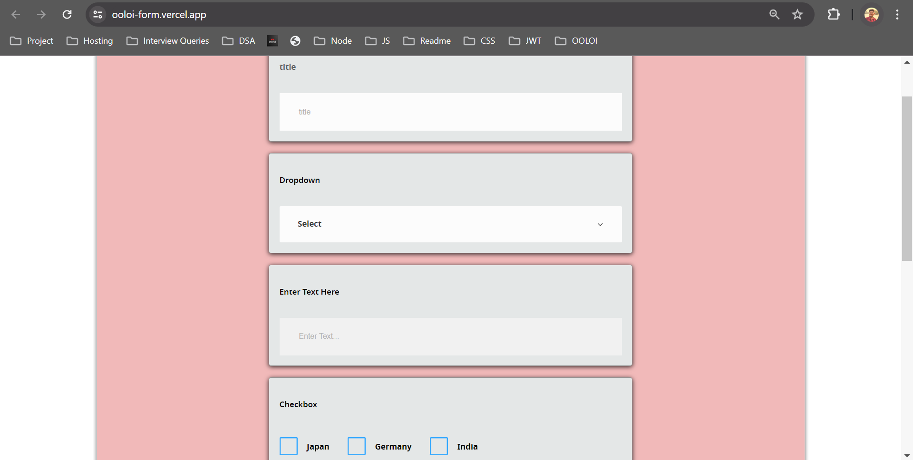
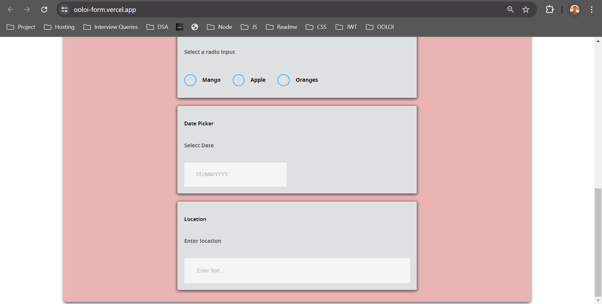

# Dynamic Form Builder

**Includes a Node.js backend server provides JSON data that defines the configuration for each form component. The frontend, built with React and utilizing the oolib component library, renders the form dynamically based on the provided JSON configuration**.

## Links

 - **Live Link** : [Live URL](https://ooloi-form.vercel.app/)

 - **Backend API Link** : [API URL](https://ooloi-form-backend.onrender.com/api/data)

## Screen grabs

  - 

  - 
